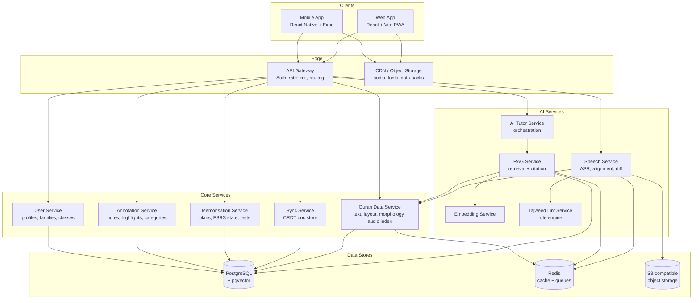
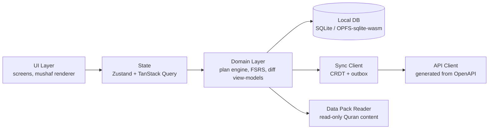
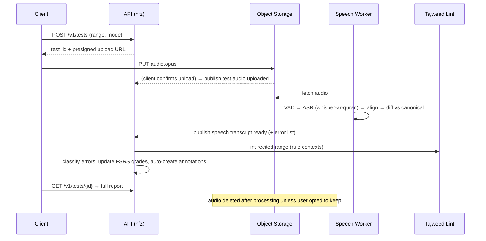
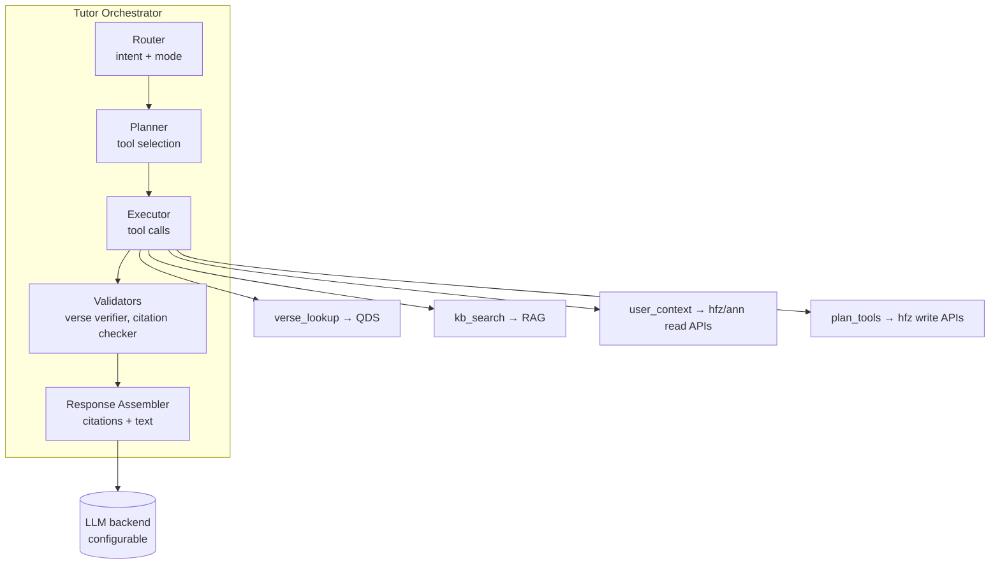
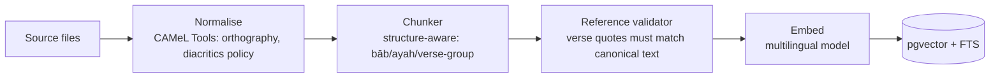
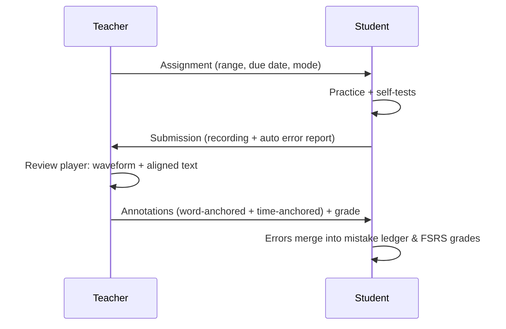
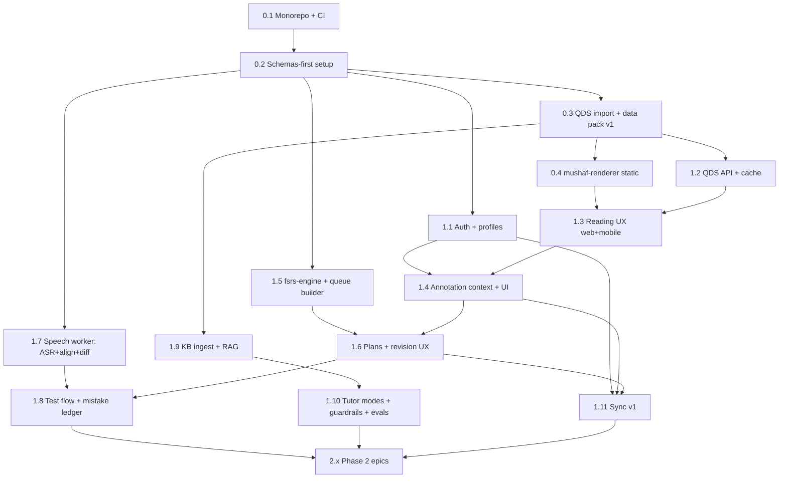

# Quran Companion — Engineering Handbook

> **Status:** Draft v1.0 · **Audience:** AI coding agents & human engineers · **Format:** Single source of truth
> **License target:** MIT (code) · Content licenses inherited per dataset (see §6.4)

This handbook is the definitive engineering reference for the open-source **AI-assisted Quran Companion** platform. It is written so that specialised AI coding agents (and human engineers) can implement any module independently, with no additional product clarification, while remaining fully compatible with every other module.

---

## Table of Contents

1. [Product Vision](#1-product-vision)
2. [Product Requirements](#2-product-requirements)
3. [Functional Requirements](#3-functional-requirements)
4. [Non-Functional Requirements](#4-non-functional-requirements)
5. [System Architecture](#5-system-architecture)
6. [Data Architecture & Quran Data Services](#6-data-architecture--quran-data-services)
7. [Database Schema](#7-database-schema)
8. [API Specifications](#8-api-specifications)
9. [Service Boundaries & Event Architecture](#9-service-boundaries--event-architecture)
10. [AI Architecture](#10-ai-architecture)
11. [RAG & Knowledge Base Architecture](#11-rag--knowledge-base-architecture)
12. [Prompt Strategy](#12-prompt-strategy)
13. [Speech & Audio Architecture](#13-speech--audio-architecture)
14. [Tajweed Correction Pipeline](#14-tajweed-correction-pipeline)
15. [Memorisation Scoring & Revision Planning](#15-memorisation-scoring--revision-planning)
16. [Family, Teacher & Community Features](#16-family-teacher--community-features)
17. [Authentication & User Management](#17-authentication--user-management)
18. [Security & Privacy](#18-security--privacy)
19. [Offline Strategy & Synchronisation](#19-offline-strategy--synchronisation)
20. [Plugin Architecture](#20-plugin-architecture)
21. [Monorepo Design](#21-monorepo-design)
22. [Documentation Set](#22-documentation-set)
23. [Testing Strategy](#23-testing-strategy)
24. [CI/CD & Deployment](#24-cicd--deployment)
25. [Monitoring & Analytics](#25-monitoring--analytics)
26. [Performance Targets](#26-performance-targets)
27. [Development Phases](#27-development-phases)
28. [AI Agent Organisation](#28-ai-agent-organisation)
29. [Task Breakdown & Implementation Order](#29-task-breakdown--implementation-order)
30. [Future Extensibility](#30-future-extensibility)
31. [Decision Log Index](#31-decision-log-index)

---

# 1. Product Vision

## 1.1 Mission

Build the most comprehensive **open-source, AI-assisted Quran platform** — a companion that supports a Muslim's lifelong relationship with the Quran across reading, memorisation (hifz), revision, tajweed mastery, reflection, and learning — for individuals, families, teachers, and study circles.

## 1.2 Guiding Principles

| # | Principle | Engineering implication |
|---|-----------|------------------------|
| P1 | **Authenticity is non-negotiable** | Quran text, tafsīr, and Islamic knowledge come only from verified, citable sources. The AI may *never* generate a verse, hadith, or ruling from its own weights without a retrieved, cited source. Enforced at the RAG layer (§11) and by output validators (§10.6). |
| P2 | **Reuse before rebuild** | Mature open-source projects (Tanzil, QUL, quran-align, Quranic Arabic Corpus, OpenITI, CAMeL Tools, Whisper fine-tunes) are integrated, not reimplemented. |
| P3 | **Local-first, privacy-first** | Recitation audio and personal notes are sensitive. Data lives on-device by default; cloud sync is opt-in and end-to-end encrypted for private content (§18, §19). |
| P4 | **Modular, agent-buildable** | Every feature is an independently buildable module with a defined interface, owner, and Definition of Done (§28). |
| P5 | **Offline is a feature, not a fallback** | Core reading, memorisation, and revision must work fully offline (§19). |
| P6 | **Extensible by plugins** | New tafsīr collections, reciters, AI models, and educational modules attach through a plugin contract without core changes (§20). |

## 1.3 Target Users (Personas)

| Persona | Needs | Priority |
|---|---|---|
| **Hafiz / advanced memoriser** | On-demand recall testing from any point, weakness detection, similar-verse (mutashābihāt) drills, long-term retention analytics | MVP |
| **Hifz student** | Daily new-memorisation plan, revision scheduling, recitation self-testing, teacher feedback loop | MVP |
| **Tajweed student** | Word-level annotation of errors, rule explanations tied to a verified matn, recitation correction | MVP |
| **Parent** | Child profiles, voice-controlled playback (Arabic voice commands), progress oversight, safe content | Phase 2 |
| **Teacher / sheikh** | Class roster, assignment of portions, annotated review of student recordings, progress dashboards | Phase 2 |
| **General reader** | Reading with translations, tafsīr, reflection notes, word-by-word study | MVP |
| **Qira'at learner** | Riwāyah-aware text and audio, comparative display | Phase 3 |

## 1.4 What This Platform Is Not

- Not a fatwa service. The AI tutor answers only from retrieved, cited sources and defers to qualified scholars for rulings.
- Not a social network. Community features are limited to shared study plans, note templates, and teacher-student workflows.
- Not a closed SaaS. Everything needed to self-host is in the monorepo.

---

# 2. Product Requirements

## 2.1 Product Pillars

1. **Read** — Mushaf-accurate rendering (Madani page layout), translations, word-by-word, tafsīr, audio with word-level highlighting.
2. **Memorise** — Structured hifz plans, chunking, audio loops, active-recall testing, first-word prompting, similar-verse disambiguation.
3. **Revise** — Spaced-repetition scheduling (FSRS-based), diagnostic "detection recitation" cycles, heatmaps, forgetting prediction.
4. **Recite & Correct** — On-device/edge ASR of recitation, diff against the canonical text, tajweed-rule feedback, teacher review.
5. **Learn** — Tajweed curriculum tied to classical texts (e.g., Tuḥfat al-Aṭfāl, al-Jazariyyah, al-Tuḥfa al-Samnūdiyya), vocabulary builder, root-word explorer, qira'at (later phases).
6. **Reflect** — Personal notes, categorised annotations at word/range granularity, journaling, semantic search over one's own notes.
7. **Together** — Family profiles, child mode with Arabic voice commands, teacher workflows, community-shared plans.

## 2.2 Release Definition

| Tier | Contents (summary) | Detailed scope |
|---|---|---|
| **MVP** | Mushaf reading, word-level annotations, hifz plans + FSRS revision, self-test recitation diff (server-side ASR), AI tutor with strict RAG citations, offline reading/revision, single-user auth + sync | §27 Phase 1 |
| **Phase 2** | Family + child voice mode, teacher review workflow, memorisation heatmap + forgetting prediction, confused-verse detection, vocabulary builder, community-shared plans, E2EE sync | §27 Phase 2 |
| **Phase 3** | On-device ASR, tajweed acoustic classification, root-word explorer, semantic search, qira'at module, plugin marketplace | §27 Phase 3 |
| **Future** | Phoneme-level tajweed scoring, live halaqah rooms, OCR of personal mushaf annotations, multi-madhhab knowledge packs | §30 |

---

# 3. Functional Requirements

Requirements are numbered `FR-<area>-<n>` and referenced throughout the handbook and in task breakdowns (§29). Priority: **M**ust (MVP), **S**hould (Phase 2), **C**ould (Phase 3+).

## 3.1 Reading (RD)

| ID | Requirement | Pri |
|---|---|---|
| FR-RD-1 | Render the Quran in authentic Madani mushaf page layout (604 pages) using QPC v2/KFGQPC glyph fonts and QUL page layout data | M |
| FR-RD-2 | Continuous (scroll) and paged reading modes; translation view with selectable translations (Tanzil/QUL sourced) | M |
| FR-RD-3 | Word-by-word display: Arabic + gloss + transliteration + morphology (from Quranic Arabic Corpus data) | M |
| FR-RD-4 | Audio playback per ayah/range/surah with word-level highlight sync (quran-align / QUL segment data) | M |
| FR-RD-5 | Tafsīr panel: at least 2 Arabic + 2 translated tafsīr collections from QUL, selectable, offline-downloadable | M |
| FR-RD-6 | Bookmarks, last-read positions (multiple named positions), navigation by surah/juz/hizb/page/ayah | M |
| FR-RD-7 | Tajweed-colour text rendering option (rule-coloured letters) | S |
| FR-RD-8 | Riwāyah selection (Ḥafṣ default; Warsh, Qālūn later) affecting text, layout, and audio | C |

## 3.2 Annotation (AN) — Mushafi feature set

| ID | Requirement | Pri |
|---|---|---|
| FR-AN-1 | Tap-select a single word or drag-select a word range on the mushaf | M |
| FR-AN-2 | Attach a categorised note to a selection; categories form a user-extensible tree with seeded roots: حفظ (memorisation), تجويد (tajweed), وقف وابتداء (stopping/starting) | M |
| FR-AN-3 | Colour-coded highlight rendering per category; filter highlights by category/surah/date | M |
| FR-AN-4 | Word addressing uses canonical `(surah, ayah, word_position)` integers compatible with Quran Foundation / QUL word IDs | M |
| FR-AN-5 | Notes support text, audio snippets, and links to tajweed rules in the knowledge base | S |
| FR-AN-6 | Export/import annotations (JSON), shareable note templates | S |

## 3.3 Memorisation (HZ)

| ID | Requirement | Pri |
|---|---|---|
| FR-HZ-1 | Create hifz plans: target portion, daily new amount, revision ratios (e.g., classical سبق/سبقي/منزل — new / near-past / long-past cycles) | M |
| FR-HZ-2 | Memorisation session tools: segment looping, hide-text recall mode, first-word/first-letter prompting, audio-before-text mode | M |
| FR-HZ-3 | Self-testing: recite from a random or chosen starting point; system transcribes and diffs against canonical text; errors classified (omission, substitution, insertion, hesitation, similar-verse jump) | M |
| FR-HZ-4 | Diagnostic "detection recitation" cycle: a structured pass over already-memorised portions that records a four-symbol classification per incident — complete stop, hesitation/substitution, similar-verse confusion, contextual pattern note | M |
| FR-HZ-5 | Per-ayah and per-page **strength score** (0–100) derived from test history + FSRS memory state | M |
| FR-HZ-6 | **Memorisation heatmap**: mushaf-page and juz-level visualisation of strength; **forgetting prediction** surfaces portions predicted to fall below a retention threshold within N days | S |
| FR-HZ-7 | **Confused-verse detection**: automatic identification of mutashābihāt pairs the user actually confuses (from test history), plus a curated similar-verse dataset for proactive drills | S |
| FR-HZ-8 | Mistake ledger integrated with annotations (an error in a test auto-creates/updates a حفظ annotation on the exact word) | M |

## 3.4 Revision Planning (RV)

| ID | Requirement | Pri |
|---|---|---|
| FR-RV-1 | FSRS-based scheduling at configurable granularity (ayah-group / quarter-page / page) with per-item memory state | M |
| FR-RV-2 | Daily queue generation respecting a user-set time budget and classical cycle constraints (recent portions revised daily regardless of FSRS) | M |
| FR-RV-3 | Manual grading (Again/Hard/Good/Easy) and automatic grading from recitation-test results | M |
| FR-RV-4 | Plan repair: missed days redistribute load without silently dropping items | M |
| FR-RV-5 | Long-term retention analytics dashboard (retention curve, workload forecast, strength trends) | S |

## 3.5 Recitation & Tajweed Correction (TJ)

| ID | Requirement | Pri |
|---|---|---|
| FR-TJ-1 | Record recitation with on-device VAD trimming; upload optional (privacy default: process-and-discard, see §18) | M |
| FR-TJ-2 | ASR transcription with diacritics using Quran-fine-tuned Whisper family models; word-level alignment to canonical text | M |
| FR-TJ-3 | Text-level error report: per-word verdict (correct / substituted / omitted / inserted / skipped-to-similar-verse) rendered on the mushaf | M |
| FR-TJ-4 | Rule-based tajweed lint on the *text path*: given the canonical text and stop position, flag rule contexts (madd, ghunnah, idghām, qalqalah, waqf validity) for the recited range and link each to knowledge-base rule cards | S |
| FR-TJ-5 | Acoustic tajweed classification (e.g., madd duration, ghunnah presence) — research-grade, clearly labelled as assistive, never authoritative | C |
| FR-TJ-6 | Teacher review workflow: student submits a recording; teacher plays it with the aligned text, drops time-anchored + word-anchored annotations, returns structured feedback | S |

## 3.6 AI Tutor & Knowledge (AI)

| ID | Requirement | Pri |
|---|---|---|
| FR-AI-1 | Conversational tutor that answers Quran/tajweed questions **only** with retrieved, cited passages from the curated knowledge base; refuses or defers when no source is found | M |
| FR-AI-2 | Every verse quoted by the AI is fetched verbatim from the canonical text store by reference — never generated | M |
| FR-AI-3 | Tutor modes: explain a verse (tafsīr-grounded), explain a tajweed rule (matn-grounded), quiz me, plan my week | M |
| FR-AI-4 | **Semantic search**: search the Quran and one's own notes by meaning (multilingual embeddings), always resolving results to canonical verse references | S |
| FR-AI-5 | **Root-word explorer**: browse all occurrences of a triliteral root across the Quran with morphology (Quranic Arabic Corpus data) | S |
| FR-AI-6 | **Personal vocabulary builder**: user saves words during reading; system generates FSRS flashcards with root, morphology, gloss, and example ayāt | S |
| FR-AI-7 | Configurable model backends (Anthropic API default; local/self-hosted via plugin) | S |

## 3.7 Family & Child Mode (FM)

| ID | Requirement | Pri |
|---|---|---|
| FR-FM-1 | Family accounts: guardian + child profiles; child profiles have no direct messaging, no external links, restricted AI surface | S |
| FR-FM-2 | **Arabic voice-command player** for children: select surah/ayah, repeat N times, next/previous, switch reciter — entirely by spoken Arabic commands; grammar-constrained command recognition (not open dictation) | S |
| FR-FM-3 | Guardian dashboard: child listening/memorisation activity, streaks, assigned portions | S |
| FR-FM-4 | Teacher features: classes, rosters, portion assignments, submission inbox, annotated review (see FR-TJ-6), class analytics | S |

## 3.8 Community (CM)

| ID | Requirement | Pri |
|---|---|---|
| FR-CM-1 | Publish/subscribe **study-plan templates** and **note templates** (content-moderated, no free-form social feed) | S |
| FR-CM-2 | Attribution and versioning of shared templates; one-tap fork into personal plans | S |

## 3.9 Platform (PL)

| ID | Requirement | Pri |
|---|---|---|
| FR-PL-1 | Mobile app (iOS/Android) and web app with feature parity for reading/memorisation/revision | M |
| FR-PL-2 | Full offline operation of reading, annotation, memorisation, and revision; sync on reconnect | M |
| FR-PL-3 | Multi-device sync with conflict-free merging of annotations and revision state | M |
| FR-PL-4 | Plugin system per §20 | C |
| FR-PL-5 | Interface languages: Arabic (RTL-first) and English at minimum; i18n framework for more | M |

---

# 4. Non-Functional Requirements

| ID | Category | Requirement |
|---|---|---|
| NFR-1 | **Correctness** | Quran text checksums verified against Tanzil Uthmani reference at build time and at every client data-pack install. Any mismatch is a fatal error. |
| NFR-2 | **Availability** | Backend 99.5% monthly (self-host tier); clients degrade gracefully to full offline. |
| NFR-3 | **Performance** | See §26 for concrete budgets (page render < 16 ms/frame, audio highlight drift < 60 ms, ASR feedback < 5 s for a 30 s clip on server path). |
| NFR-4 | **Privacy** | Recitation audio never retained server-side beyond processing unless the user explicitly saves/submits it. Private notes E2EE in Phase 2 (§18.4). |
| NFR-5 | **Security** | OWASP ASVS L2; all services behind authenticated gateway; secrets via environment/secret manager only. |
| NFR-6 | **Accessibility** | WCAG 2.1 AA on web; dynamic type, screen-reader labels, high-contrast mushaf theme. |
| NFR-7 | **Internationalisation** | RTL-first layouts; all UI strings externalised; Arabic typography correctness (no broken ligatures, correct Uthmani glyphs). |
| NFR-8 | **Portability** | Entire backend runs via `docker compose up` for self-hosting; no proprietary cloud dependency in core path. |
| NFR-9 | **Licensing** | Core code MIT; every bundled dataset carries its upstream license and attribution manifest (§6.4). |
| NFR-10 | **Cost** | AI features degrade to cheaper/local models by configuration; no feature hard-requires a paid API. |
| NFR-11 | **Observability** | Structured logs, traces, metrics on every service (§25); no PII in logs. |
| NFR-12 | **Data integrity** | Sync is loss-less: no silent overwrite; conflicts resolved by CRDT merge or surfaced to the user (§19). |

---

# 5. System Architecture

## 5.1 High-Level Architecture



## 5.2 Architectural Style & Rationale

| Decision | Choice | Alternatives | Rationale |
|---|---|---|---|
| Service granularity | **Modular monolith → extractable services** (single FastAPI app composed of bounded-context packages; Speech runs as a separate worker from day 1) | Full microservices; single flat monolith | AI agents build against clean package boundaries; ops stays simple for self-hosters; the only genuinely different runtime profile (GPU/CPU-heavy speech) is isolated early. |
| Client architecture | **Local-first**: clients own a local database; server is a sync + compute peer | Thin clients | FR-PL-2/3; offline is a pillar; hifz sessions happen without connectivity. |
| Data flow | **REST for request/response, event bus (Redis Streams) for async pipelines** | gRPC, Kafka | REST is friction-free for agents and self-hosters; Redis Streams is already in the stack, sufficient at this scale, upgradeable to NATS/Kafka behind the `events` package interface. |
| Quran content | **Bundled data packs built from Tanzil/QUL + optional live Quran Foundation API** | API-only | API-only breaks offline (FR-PL-2). Data packs are versioned, checksummed artifacts (§6.3); the API remains a source for pack building and online-only extras. |

## 5.3 Client Architecture (shared pattern, both platforms)



Rules:
- The **mushaf renderer**, **FSRS engine**, **diff view-model**, and **sync client** are shared TypeScript packages (`packages/*`) consumed by both apps — never duplicated.
- Local DB schema mirrors the server's logical model for user-owned entities (§7) and is the source of truth on-device.
- All server calls go through the generated API client; no hand-written fetch calls in feature code.

---

# 6. Data Architecture & Quran Data Services

## 6.1 Canonical Addressing (the most important contract in the system)

Every module addresses Quran content the same way:

```
VerseKey  = (surah: int 1..114, ayah: int)          e.g. 2:255
WordKey   = (surah, ayah, word_position: int 1..n)   e.g. 2:255:3
WordRange = (start: WordKey, end: WordKey)           inclusive, ordered
PageRef   = (mushaf_id: string, page: int 1..604)
```

- `word_position` follows the space-split ordering of the QPC Ḥafṣ text used by QUL/Quran Foundation word APIs, so annotations remain compatible with `surah:ayah:word_position` integer addressing.
- A `mushaf_id` names a specific layout+script edition (e.g., `qpc-hafs-madani-604`). Word keys are layout-independent; page refs are layout-dependent. A mapping table `word_key → (mushaf_id, page, line)` ships in the data pack.
- **No module may store Quran text copied into its own tables.** Text is referenced by key and resolved via the Quran Data Service / data pack. (Prevents drift; keeps user DB small; matches licensing.)

## 6.2 Source Datasets (reuse, do not rebuild)

| Need | Source | Notes |
|---|---|---|
| Canonical Uthmani text (Ḥafṣ) | **Tanzil** quran-uthmani + **QUL (qul.tarteel.ai)** QPC texts | Checksummed reference; QUL provides script variants (v1/v2 glyph-coded, imlaei) |
| Page layout (Madani 604) | **QUL mushaf layouts** | line/page word placement per mushaf edition |
| Fonts | **KFGQPC / QPC v2 fonts** via QUL | per-page glyph fonts for authentic rendering |
| Word-by-word gloss & transliteration | **QUL word-by-word datasets** / quranwbw | multiple languages |
| Morphology, roots, lemmas, POS | **Quranic Arabic Corpus** (corpus.quran.com dataset) | powers root explorer (FR-AI-5) and vocabulary builder |
| Translations | **Tanzil translations** + QUL | 40+ languages, versioned |
| Tafsīr | **QUL tafsīr collections** | licensed collections with attribution |
| Ayah audio (many reciters) | **EveryAyah**, QUL audio, Quran Foundation CDN | per-ayah MP3 naming convention |
| Word-level audio timestamps | **cpfair/quran-align** released timing files + QUL segments (also exposed by Quran Foundation audio API `?segments=true`) | CC-BY 4.0 timing data; enables word highlight + word loops |
| Quran ASR models | **tarteel-ai/whisper-base-ar-quran**, whisper-tiny variant, community LoRA fine-tunes (e.g. diacritic-sensitive adapters) | Hugging Face; §13 |
| Similar verses (mutashābihāt) | Curated open datasets + generated candidates via n-gram/embedding similarity, human-reviewed | powers FR-HZ-7 |
| Tajweed rule metadata | Rule-annotated text datasets (e.g., open tajweed colour-coding data) + hand-authored rule cards sourced from classical texts | §14 |
| Classical texts corpus | **OpenITI** | source for knowledge base ingestion (§11) |
| Arabic NLP | **CAMeL Tools** (Python), Farasa (optional) | normalisation, morphology fallback, diacritisation utilities |

## 6.3 Data Packs (offline distribution unit)

A **data pack** is a versioned, signed artifact (`.qpack` = zip + manifest) built by `tools/pack-builder`:

```json
{
  "manifest_version": 1,
  "pack_id": "core-hafs",
  "version": "2026.07.0",
  "contents": ["text:qpc-hafs", "layout:qpc-hafs-madani-604", "wbw:en", "morphology:qac-0.4"],
  "checksums": { "text:qpc-hafs": "sha256:..." },
  "licenses": [{ "item": "morphology:qac-0.4", "license": "GPL-compatible-check", "attribution": "..." }],
  "signature": "ed25519:..."
}
```

Rules:
- Clients refuse unsigned or checksum-failing packs (NFR-1).
- Packs are immutable; updates ship as new versions; the client keeps at most current + previous.
- Audio is **not** packed by default; it streams from CDN with a per-reciter offline download manager (per-surah granularity, resumable).

## 6.4 Licensing Manifest

`schemas/licenses.json` is the single registry of every third-party dataset, its license, attribution string, and usage constraints. CI fails if a pack references an item absent from the registry. The About screen renders attributions from this file.

## 6.5 Quran Data Service (QDS)

Responsibilities: serve text/layout/wbw/morphology/tafsīr/audio-index by canonical keys; build-time import pipelines from upstream sources; Redis cache (24 h TTL) in front of PostgreSQL reference tables; produce data packs.

Interface sketch (full spec in §8):
```
GET /v1/quran/verses/{surah}:{ayah}?fields=text,words,translations&translation_ids=...
GET /v1/quran/pages/{mushaf_id}/{page}
GET /v1/quran/words/{surah}:{ayah}:{pos}
GET /v1/quran/roots/{root}?include=occurrences,morphology
GET /v1/quran/audio/{reciter_id}/{surah}:{ayah}?segments=true
GET /v1/quran/similar/{surah}:{ayah}          # mutashābihāt candidates
GET /v1/quran/tafsir/{collection_id}/{surah}:{ayah}
```

---

# 7. Database Schema

PostgreSQL 16 + pgvector. Migrations via Alembic. Naming: `snake_case`, singular schema names per bounded context: `usr`, `ann`, `hfz`, `sync`, `qds`, `kb`, `fam`, `cm`.

## 7.1 Entity-Relationship Overview

```mermaid
erDiagram
    USER ||--o{ PROFILE : has
    USER ||--o{ DEVICE : registers
    FAMILY ||--o{ FAMILY_MEMBER : contains
    USER ||--o{ FAMILY_MEMBER : "is"
    CLASS ||--o{ CLASS_MEMBER : contains
    PROFILE ||--o{ CATEGORY : owns
    CATEGORY ||--o{ CATEGORY : parent
    PROFILE ||--o{ ANNOTATION : owns
    CATEGORY ||--o{ ANNOTATION : classifies
    PROFILE ||--o{ HIFZ_PLAN : owns
    HIFZ_PLAN ||--o{ PLAN_ITEM : schedules
    PROFILE ||--o{ REVIEW_ITEM : tracks
    REVIEW_ITEM ||--o{ REVIEW_LOG : records
    PROFILE ||--o{ RECITATION_TEST : takes
    RECITATION_TEST ||--o{ TEST_ERROR : produces
    PROFILE ||--o{ SUBMISSION : submits
    SUBMISSION ||--o{ REVIEW_ANNOTATION : receives
    PROFILE ||--o{ VOCAB_CARD : saves
    PROFILE ||--o{ SYNC_DOC : syncs
```

## 7.2 Key Tables (selected DDL)

```sql
-- usr: identity & profiles ---------------------------------------------------
CREATE TABLE usr.user (
    id              uuid PRIMARY KEY DEFAULT gen_random_uuid(),
    auth_subject    text UNIQUE NOT NULL,          -- from auth provider (Supabase/Keycloak sub)
    email           citext UNIQUE,
    created_at      timestamptz NOT NULL DEFAULT now()
);

CREATE TABLE usr.profile (                          -- a user can hold multiple profiles (self, child)
    id              uuid PRIMARY KEY DEFAULT gen_random_uuid(),
    user_id         uuid NOT NULL REFERENCES usr.user(id),
    kind            text NOT NULL CHECK (kind IN ('adult','child')),
    display_name    text NOT NULL,
    locale          text NOT NULL DEFAULT 'ar',
    settings        jsonb NOT NULL DEFAULT '{}'
);

-- ann: annotations -----------------------------------------------------------
CREATE TABLE ann.category (
    id              uuid PRIMARY KEY,
    profile_id      uuid NOT NULL REFERENCES usr.profile(id),
    parent_id       uuid REFERENCES ann.category(id),
    name            text NOT NULL,
    color           text NOT NULL,                  -- hex
    seeded_key      text,                           -- 'hifz' | 'tajweed' | 'waqf' | NULL
    sort_order      int NOT NULL DEFAULT 0,
    deleted_at      timestamptz
);

CREATE TABLE ann.annotation (
    id              uuid PRIMARY KEY,
    profile_id      uuid NOT NULL REFERENCES usr.profile(id),
    category_id     uuid NOT NULL REFERENCES ann.category(id),
    start_surah     smallint NOT NULL, start_ayah smallint NOT NULL, start_word smallint NOT NULL,
    end_surah       smallint NOT NULL, end_ayah   smallint NOT NULL, end_word   smallint NOT NULL,
    body            text,
    audio_object    text,                           -- object-storage key, nullable
    source          text NOT NULL DEFAULT 'manual'  -- 'manual' | 'test' | 'teacher'
        CHECK (source IN ('manual','test','teacher')),
    created_at      timestamptz NOT NULL DEFAULT now(),
    updated_at      timestamptz NOT NULL DEFAULT now(),
    deleted_at      timestamptz
);
CREATE INDEX ON ann.annotation (profile_id, start_surah, start_ayah);

-- hfz: memorisation & revision -----------------------------------------------
CREATE TABLE hfz.review_item (                      -- one FSRS-tracked unit
    id              uuid PRIMARY KEY,
    profile_id      uuid NOT NULL REFERENCES usr.profile(id),
    unit_kind       text NOT NULL CHECK (unit_kind IN ('ayah_group','quarter_page','page','vocab')),
    start_surah     smallint NOT NULL, start_ayah smallint NOT NULL,
    end_surah       smallint NOT NULL, end_ayah   smallint NOT NULL,
    -- FSRS memory state
    stability       real NOT NULL DEFAULT 0,
    difficulty      real NOT NULL DEFAULT 0,
    due_at          timestamptz,
    last_review_at  timestamptz,
    reps            int NOT NULL DEFAULT 0,
    lapses          int NOT NULL DEFAULT 0,
    strength        smallint NOT NULL DEFAULT 0     -- derived 0..100, denormalised for heatmap
);
CREATE INDEX ON hfz.review_item (profile_id, due_at);

CREATE TABLE hfz.review_log (
    id              uuid PRIMARY KEY,
    item_id         uuid NOT NULL REFERENCES hfz.review_item(id),
    reviewed_at     timestamptz NOT NULL,
    grade           smallint NOT NULL CHECK (grade BETWEEN 1 AND 4),  -- Again..Easy
    source          text NOT NULL CHECK (source IN ('manual','recitation_test')),
    elapsed_days    real NOT NULL
);

CREATE TABLE hfz.recitation_test (
    id              uuid PRIMARY KEY,
    profile_id      uuid NOT NULL REFERENCES usr.profile(id),
    started_at      timestamptz NOT NULL,
    mode            text NOT NULL CHECK (mode IN ('self','detection','assignment')),
    start_surah     smallint, start_ayah smallint,
    end_surah       smallint, end_ayah smallint,
    asr_model       text,
    wer             real,                            -- word error rate vs canonical
    summary         jsonb NOT NULL DEFAULT '{}'
);

CREATE TABLE hfz.test_error (
    id              uuid PRIMARY KEY,
    test_id         uuid NOT NULL REFERENCES hfz.recitation_test(id),
    surah smallint NOT NULL, ayah smallint NOT NULL, word smallint NOT NULL,
    kind            text NOT NULL CHECK (kind IN
        ('stop','hesitation','substitution','omission','insertion','similar_jump','context_note')),
    detail          jsonb NOT NULL DEFAULT '{}',     -- e.g. {"jumped_to": "3:120:1"}
    annotation_id   uuid REFERENCES ann.annotation(id)  -- auto-created ledger link (FR-HZ-8)
);

-- kb: knowledge base ----------------------------------------------------------
CREATE TABLE kb.document (
    id              uuid PRIMARY KEY,
    source_key      text NOT NULL,                   -- e.g. 'matn:tuhfa-samnudiyya'
    title           text NOT NULL,
    lang            text NOT NULL,
    license         text NOT NULL,
    version         text NOT NULL
);
CREATE TABLE kb.chunk (
    id              uuid PRIMARY KEY,
    document_id     uuid NOT NULL REFERENCES kb.document(id),
    ordinal         int NOT NULL,
    text            text NOT NULL,
    ref             jsonb NOT NULL,                  -- page, bab, verse numbers for citation
    embedding       vector(1024)
);
CREATE INDEX ON kb.chunk USING hnsw (embedding vector_cosine_ops);

-- sync ------------------------------------------------------------------------
CREATE TABLE sync.doc (
    id              uuid PRIMARY KEY,
    profile_id      uuid NOT NULL REFERENCES usr.profile(id),
    doc_key         text NOT NULL,                   -- e.g. 'annotations', 'plans'
    encrypted       boolean NOT NULL DEFAULT false,  -- E2EE payloads (Phase 2)
    snapshot        bytea NOT NULL,                  -- CRDT snapshot (or ciphertext)
    version_vector  jsonb NOT NULL,
    updated_at      timestamptz NOT NULL,
    UNIQUE (profile_id, doc_key)
);
```

Reference tables in `qds.*` (verses, words, pages, roots, morphology, audio segments, similar-verse pairs, tafsīr) are import-generated, read-only at runtime, and rebuilt only by the pack/import pipeline.

## 7.3 Schema Governance

- Every migration is owned by exactly one bounded context; cross-schema FKs allowed only toward `usr.profile`.
- `schemas/` in the monorepo holds JSON Schema definitions for all API payloads and CRDT doc shapes; server and clients generate types from them (single source of truth).

---

# 8. API Specifications

## 8.1 Conventions

- OpenAPI 3.1 spec is authored first in `schemas/openapi/` and is the contract; FastAPI routes are generated/validated against it in CI.
- Versioned base path `/v1`. JSON everywhere; `snake_case` fields; RFC 9457 problem+json errors; cursor pagination (`?cursor=&limit=`).
- Auth: `Authorization: Bearer <JWT>`; profile scoping via `X-Profile-Id` header validated against token.
- Idempotency: all mutating endpoints accept `Idempotency-Key`.

## 8.2 Endpoint Map (summary)

| Area | Endpoints (representative) |
|---|---|
| Quran data | `GET /v1/quran/...` (see §6.5) — public, cacheable, ETag'd |
| Annotations | `GET/POST /v1/annotations`, `PATCH/DELETE /v1/annotations/{id}`, `GET/POST /v1/categories` |
| Plans | `GET/POST /v1/plans`, `POST /v1/plans/{id}/repair`, `GET /v1/queue/today` |
| Reviews | `POST /v1/reviews` (grade an item), `GET /v1/items?due=today` |
| Tests | `POST /v1/tests` → returns upload URL; `GET /v1/tests/{id}` (status/result); `POST /v1/tests/{id}/errors/confirm` |
| Speech | `POST /v1/speech/transcribe` (short clips, sync ≤ 30 s), async via tests pipeline |
| Tutor | `POST /v1/tutor/messages` (SSE stream), `GET /v1/tutor/threads` |
| Search | `GET /v1/search?q=&scope=quran|notes|kb&mode=semantic|lexical` |
| Vocabulary | `POST /v1/vocab/cards`, `GET /v1/vocab/due` |
| Family | `POST /v1/families`, `POST /v1/families/{id}/children`, `GET /v1/families/{id}/activity` |
| Teacher | `POST /v1/classes`, `POST /v1/assignments`, `POST /v1/submissions`, `POST /v1/submissions/{id}/review` |
| Community | `GET/POST /v1/templates` (plan/note templates), `POST /v1/templates/{id}/fork` |
| Sync | `GET/PUT /v1/sync/{doc_key}` (snapshot + version vector), `POST /v1/sync/{doc_key}/changes` |

## 8.3 Representative Examples

Create an annotation:
```http
POST /v1/annotations
{ "category_id": "…", "range": { "start": "2:255:3", "end": "2:255:5" },
  "body": "مد لازم — انتبه للتطويل ست حركات" }
→ 201 { "id": "…", "range": {…}, "created_at": "…" }
```

Submit a recitation test:
```http
POST /v1/tests { "mode": "detection", "range": { "start": "2:1", "end": "2:141" } }
→ 201 { "id": "t_1", "upload": { "url": "https://…", "method": "PUT", "expires_in": 900 } }
-- client PUTs audio, then:
GET /v1/tests/t_1
→ 200 { "status": "done", "wer": 0.031,
        "errors": [ { "at": "2:106:4", "kind": "similar_jump", "detail": { "jumped_to": "16:101:4" } } ] }
```

Tutor message (SSE):
```http
POST /v1/tutor/messages { "thread_id": "…", "mode": "explain_verse", "verse": "2:255", "text": "اشرح لي معنى الكرسي هنا" }
→ stream of { "type": "citation", "source": "tafsir:ibn-kathir", "ref": {…} } and { "type": "token", … }
```

---

# 9. Service Boundaries & Event Architecture

## 9.1 Bounded Contexts & Ownership

| Context | Package | Owns tables | Publishes events | Consumes |
|---|---|---|---|---|
| Identity | `services/api/app/usr` | `usr.*`, `fam.*` | `profile.created` | — |
| Annotation | `.../ann` | `ann.*` | `annotation.created/updated` | `test.error.confirmed` |
| Memorisation | `.../hfz` | `hfz.*` | `test.completed`, `item.reviewed` | `speech.transcript.ready` |
| Quran Data | `.../qds` | `qds.*` | — | — |
| Knowledge/RAG | `.../kb` | `kb.*` | — | — |
| Sync | `.../sync` | `sync.*` | `sync.doc.updated` | — |
| Speech (worker) | `services/speech` | — (object storage only) | `speech.transcript.ready` | `test.audio.uploaded` |
| Tutor | `services/api/app/tutor` | thread tables | — | — |

Hard rules: contexts never import each other's internals; interaction is via public Python interfaces in `services/api/app/<ctx>/api.py` or events. Speech worker communicates only via events + object storage.

## 9.2 Event Bus

Redis Streams, one stream per event type, consumer groups per service. Envelope:

```json
{ "event_id": "uuid", "type": "speech.transcript.ready", "occurred_at": "…",
  "profile_id": "…", "payload": { "test_id": "…", "transcript_ref": "s3://…" }, "schema_version": 1 }
```

- All event payload schemas live in `schemas/events/`; producers validate before publishing.
- At-least-once delivery; consumers are idempotent (keyed on `event_id`).
- Dead-letter stream per consumer group with alerting.

## 9.3 Core Async Flow: Recitation Test



---

# 10. AI Architecture

## 10.1 Overview



## 10.2 Model Backend Abstraction

`packages/ai-core` defines a provider interface (`complete`, `stream`, `embed`) with implementations:

| Backend | Use | Default |
|---|---|---|
| Anthropic API (Claude) | Tutor reasoning, quiz generation, planning | ✔ (hosted deployments) |
| Local / self-hosted (Ollama, vLLM via OpenAI-compatible endpoint) | Self-hosters, cost control | config flag |
| Embeddings: multilingual open model (e.g., BGE-M3 class) served locally or hosted | RAG + semantic search | local by default |

No feature may call a provider SDK directly; all calls go through `ai-core` (enables plugin-provided models, §20).

## 10.3 Tutor Modes (deterministic scaffolds, not free chat)

| Mode | Tools allowed | Output contract |
|---|---|---|
| `explain_verse` | verse_lookup, kb_search(tafsīr) | Verse text (verbatim from QDS) + explanation composed **only** from retrieved tafsīr chunks, each paragraph carrying ≥1 citation |
| `explain_rule` | kb_search(matn, rule cards), verse_lookup for examples | Rule explanation grounded in matn chunks; examples resolved to canonical verses |
| `quiz_me` | user_context, verse_lookup, similar-verse data | Structured quiz JSON (first-word prompts, similar-verse discrimination items) |
| `plan_week` | user_context, plan_tools | Proposed plan diff; applied only after explicit user confirmation |
| `free_qa` | kb_search(all), verse_lookup | Answer or explicit "لم أجد مصدرًا موثوقًا لهذه المسألة" + referral note |

## 10.4 Authenticity Guardrails (implements P1, FR-AI-1/2)

1. **Verse Verifier**: any Arabic span in model output that looks like Quran (classifier + fuzzy match against canonical text) must exactly match the canonical text for a cited VerseKey; otherwise the span is replaced by the canonical text fetched from QDS or the response is rejected and regenerated.
2. **Citation Checker**: every factual paragraph must reference ≥1 retrieved chunk id; uncited paragraphs cause regeneration with a stricter prompt; after 2 failures, the tutor returns the honest "no source found" response.
3. **Scope fence**: fiqh rulings, creed disputes, and medical/psychological topics route to a fixed deferral template (with the retrieved general material, if any, clearly attributed).
4. **Child surface**: child profiles get `explain_verse`-lite and quiz modes only; no free_qa.

## 10.5 Feature-Specific AI Components

| Feature | Approach |
|---|---|
| Forgetting prediction (FR-HZ-6) | Pure FSRS retrievability projection per item (`R(t)` from stability); no LLM. Heatmap colours = projected retention at horizon N days. |
| Confused-verse detection (FR-HZ-7) | Offline job: n-gram overlap + embedding similarity over canonical text generates candidate pairs → shipped as reviewed dataset; runtime joins user `test_error(kind='similar_jump')` history to rank *personally* confused pairs. |
| Semantic search (FR-AI-4) | pgvector HNSW over verse embeddings (per-translation + Arabic) and user note embeddings; results always resolve to VerseKeys; lexical fallback via PostgreSQL FTS. |
| Vocabulary builder (FR-AI-6) | Deterministic: word → QAC morphology (root, lemma, POS, gloss) → FSRS card; LLM used only to phrase example sentences from *retrieved* ayāt containing the same root. |
| Quiz generation | Template-driven with LLM filling constrained slots; every answer key is machine-verified against canonical data before display. |

## 10.6 AI Safety & Quality Evaluation

- Golden-set eval suite in `tools/ai-evals/`: 200+ Q/A pairs with required citations; CI gate on citation precision ≥ 0.95 and zero fabricated-verse incidents.
- Red-team suite: prompts attempting to elicit uncited rulings, fabricated verses, or child-inappropriate content; all must hit guardrails.
- Every tutor response logs (locally, anonymised) mode, tools used, citation count — never message content in server logs.

---

# 11. RAG & Knowledge Base Architecture

## 11.1 Corpus (curated, versioned, license-checked)

| Collection | Source | Ingestion notes |
|---|---|---|
| Tafsīr (Arabic + translated) | QUL collections | chunk by ayah unit; ref = (collection, surah, ayah) |
| Tajweed mutūn | Verified digital editions (e.g., Tuḥfat al-Aṭfāl, al-Jazariyyah, al-Tuḥfa al-Samnūdiyya from verified uploads) | chunk by bāb/verse-group; ref includes page numbers; **only actual text from the verified edition — the pipeline rejects unmatched verses** |
| Rule cards | Hand-authored in `content/rule-cards/` (Markdown + YAML frontmatter citing matn lines) | reviewed via PR by content maintainers |
| Classical works (expansion) | OpenITI | selective, per-collection review before enabling |
| Word/morphology glosses | QAC | structured lookup, not embedded chunks |

## 11.2 Pipeline



Retrieval: hybrid (vector + BM25/FTS) with reciprocal-rank fusion; filter by collection + language; return chunk text, ref, and license tag. Re-ranking by a small cross-encoder is a Phase 3 optimisation flag.

## 11.3 Citation Contract

Every retrieved chunk carries a renderable citation: `{collection, title, locator (bāb/page/ayah), license}`. Clients render citations as tappable chips opening the source view. The tutor cannot emit a paragraph without at least one chip (enforced in §10.4).

---

# 12. Prompt Strategy

- All prompts live in `prompts/` as versioned Markdown templates with YAML frontmatter (`id`, `version`, `model_targets`, `eval_set`). Code loads prompts by id — never inline strings.
- Structure per prompt: role definition → hard rules (authenticity, citation, refusal) → mode contract (JSON schema of expected output) → few-shot exemplars (including refusal exemplars).
- Language: system prompts bilingual-aware; the tutor answers in the user's message language (Arabic-first quality bar; Arabic exemplars mandatory in every prompt file).
- Changes to any prompt require running `tools/ai-evals` and pass gates before merge (CI-enforced).
- `PROMPTS.md` documents the registry, versioning rules, and eval linkage.

---

# 13. Speech & Audio Architecture

## 13.1 Capabilities & Model Choices

| Capability | Model/Tool | Deployment | Phase |
|---|---|---|---|
| VAD + trim | Silero VAD | on-device + worker | MVP |
| Quran ASR (diacritic-aware) | tarteel-ai/whisper-base-ar-quran (+ evaluate community LoRA fine-tunes for diacritic-sensitive accuracy); faster-whisper (CTranslate2) runtime | Speech worker (CPU ok, GPU better) | MVP |
| Word alignment to canonical text | Constrained alignment: ASR tokens ↔ expected text via Needleman-Wunsch/edit-distance with tashkīl-aware normalisation; timestamps refined from ASR word times | worker | MVP |
| Reciter audio word segments | quran-align released timing data / QUL segments (precomputed; no runtime alignment for playback highlighting) | data pack / CDN | MVP |
| On-device ASR | whisper-tiny-ar-quran via whisper.cpp / sherpa-onnx export | mobile | Phase 3 |
| Command recognition (child mode) | Grammar-constrained recognition: small on-device ASR + finite command grammar (Vosk-style grammar or keyword-spotting), Web Speech API acceptable web fallback | on-device | Phase 2 |
| Acoustic tajweed features | Research pipeline: forced phoneme alignment (MFA with Arabic acoustic model) + duration/nasality features | worker, flagged experimental | Phase 3+ |

## 13.2 Speech Worker Design

- Python service in `services/speech`; consumes `test.audio.uploaded`; horizontal scale by consumer group; model pool warm-loaded; audio in Opus 16 kHz mono.
- Output artifact (JSON to object storage + event): transcript tokens with times, per-word alignment verdicts, WER, error candidates with classification hints (e.g., detected text matches a *different* verse ⇒ `similar_jump` with target VerseKey via canonical-text search).
- Determinism: model + version recorded on every test (`hfz.recitation_test.asr_model`).

## 13.3 Error Classification Rules (deterministic layer over ASR)

| Signal | Classification |
|---|---|
| Expected word missing, next expected word matched | `omission` |
| Token aligned to expected slot but different word (normalised) | `substitution` |
| Extra token not in expected sequence | `insertion` |
| Silence > threshold mid-sequence then resume | `hesitation` |
| Silence > threshold, no resume | `stop` |
| Suffix of transcript matches a different verse sharing the confusion prefix | `similar_jump` (+ target) |
| User/teacher-added free note | `context_note` |

These seven kinds are the canonical taxonomy (also the four-symbol detection-recitation system maps onto: stop, hesitation/substitution, similar_jump, context_note). All UIs, APIs, and analytics use these enum values.

---

# 14. Tajweed Correction Pipeline

Two clearly separated layers — a design decision to keep authoritative feedback rule-based and auditable:

1. **Text-path lint (deterministic, MVP→Phase 2)** — Given canonical text for the recited range + user's stop positions: detect rule *contexts* (nūn sākinah/tanwīn cases, madd types with required lengths, qalqalah letters, lām/rā rules, waqf validity classes from QUL waqf data). Output: rule occurrences linked to word ranges + rule cards. This is *teaching* output ("here you must apply ikhfā'"), not acoustic judgement.
2. **Acoustic assessment (experimental, Phase 3+)** — Duration ratios for madd, nasality window for ghunnah, burst detection for qalqalah, via forced alignment. Always presented as "assistive estimate — confirm with your teacher" (labelled in UI, per FR-TJ-5).

Rule engine: `packages/tajweed-rules` (pure TypeScript, shared client/server via transpile or dual impl with golden tests) encoding rules as data (`content/tajweed-rules/*.yaml`) with matn citations. Golden test corpus: annotated verses with expected rule occurrences; CI-gated.

Teacher review (FR-TJ-6) overrides machine output: teacher annotations are ground truth, feed the mistake ledger, and (with explicit consent) an anonymised eval set for model improvement.

---

# 15. Memorisation Scoring & Revision Planning

## 15.1 Scheduler: FSRS

- Use the open-source **FSRS** algorithm (py-fsrs on server, ts-fsrs on clients — identical parameters, golden cross-tests).
- Item granularity default: quarter-page for revision, ayah-group (3–5 āyāt) for new memorisation, single-word cards for vocabulary.
- Grades: manual 4-button, or derived from tests: error-free fluent ⇒ Easy/Good by fluency (hesitation count); any `similar_jump`/`stop` ⇒ Again; `substitution/omission` ⇒ Hard/Again by density.

## 15.2 Classical-Cycle Constraints (hybrid scheduling)

FSRS alone ignores the well-established hifz practice of daily near-revision. The planner enforces overlay rules reflecting common practice (سبق / سبقي / منزل):

| Layer | Content | Rule |
|---|---|---|
| New (سبق) | Today's new portion | Fixed daily amount from plan |
| Near (سبقي) | Last ~7–30 days of new material | Revised daily/every-2-days regardless of FSRS due date |
| Far (منزل) | Everything older | FSRS-scheduled, packed into the remaining time budget |

Queue builder: `queue = new + near + top-N FSRS-due by (overdueness × weakness)` within the minute budget; overflow rolls forward with plan-repair redistribution (FR-RV-4).

## 15.3 Strength Score & Heatmap

`strength = round(100 × R(t_now))` from FSRS retrievability, penalised by recent error density on the unit's words. Heatmap aggregates word→ayah→page; forgetting prediction = items with projected `R(t+N) < threshold` (default N=14, threshold=0.85), surfaced as a "at-risk portions" list.

## 15.4 Diagnostic Detection-Recitation Programme

A plan template (shipped as a community template, FR-CM-1) implementing a 30-day full-Quran diagnostic: daily portion sized by user budget; every incident recorded via the taxonomy in §13.3; output: baseline strength map + auto-generated targeted drill plan (weak units get FSRS reset with low stability; confused pairs enter a discrimination-drill deck).

---

# 16. Family, Teacher & Community Features

## 16.1 Family & Child Mode

- Guardian creates child profiles (no email/credentials for children; guardian-device bound, PIN-gated switch).
- Child UI: large targets, audio-first, no external links, no free-chat AI, activity streamed to guardian dashboard.
- **Arabic voice-command player**: finite grammar — {افتح/شغّل سورة X}, {الآية N}, {أعد/كرّر (N مرات)}, {التالي/السابق}, {غيّر القارئ إلى Y}, {قف/توقف}, {أكمل}. Grammar file in `content/voice-grammar/ar.yaml`; recognition constrained to grammar (Phase 2 web fallback: Web Speech API with post-filtering against the grammar). Mis-recognition fallback: audible "لم أفهم، قل مثلًا…" hint.

## 16.2 Teacher Workflow



- Class analytics: per-student strength maps, submission status, common-error aggregation across the class (e.g., "8/12 students err at 2:106").

## 16.3 Community Templates

- Shareable objects: hifz plan templates, note-category templates, drill decks. Stored as versioned JSON conforming to `schemas/templates/*`; moderated queue before public listing; fork = deep copy with attribution pointer. No comments/feeds in scope.

---

# 17. Authentication & User Management

| Concern | MVP | Self-host / Phase 2+ |
|---|---|---|
| Provider | **Supabase Auth** (email OTP, Apple/Google sign-in) | **Keycloak** option behind the same OIDC interface |
| Token model | OIDC JWT (short-lived) + refresh; JWKS-verified at gateway | same |
| Profiles | One user → many profiles (adult/child); all data keyed by `profile_id` | same |
| Roles | `user`, `guardian`, `teacher`, `moderator`, `admin` (JWT claims + DB) | same |
| Account deletion | Full cascade + object-storage purge within 30 days, export-before-delete offered | same |

The API depends only on an OIDC abstraction (`packages/auth-core`); Supabase specifics never leak into feature code — this keeps the self-host path clean.

---

# 18. Security & Privacy

## 18.1 Threat Model Highlights

| Asset | Threats | Controls |
|---|---|---|
| Recitation audio | Retention/leak of voice data (biometric-adjacent) | Default process-and-discard; presigned single-use uploads; lifecycle policy auto-delete; explicit opt-in for saved/submitted recordings; regional storage |
| Children's data | Profiling, contact by strangers | No child credentials; no messaging; guardian consent flows; minimal analytics for child profiles (COPPA/GDPR-K aligned) |
| Personal notes | Server compromise | Phase 2 E2EE (§18.4); at-rest encryption regardless |
| Quran text integrity | Tampered packs | Signed packs + checksums (NFR-1) |
| AI misuse | Fabricated religious content | §10.4 guardrails + eval gates |

## 18.2 Baseline Controls

TLS 1.3 everywhere; JWT verification at gateway; per-profile row-level authorisation checks in every repository method (tested); rate limiting per token+IP; dependency and container scanning in CI; secrets only via env/secret manager; audit log for admin/moderator actions.

## 18.3 Privacy Rules (product-level)

- Analytics are opt-out-able, anonymous by default, and **never** include Quran-content-linked personal data (e.g., which verses a user is weak in never leaves the account scope).
- Server logs contain ids and codes, never note bodies, transcripts, or audio.

## 18.4 E2EE Sync (Phase 2)

- Scope: annotation bodies, note audio, journal text (structural/scheduling data stays server-readable to enable teacher/family features the user opts into).
- Design: per-profile symmetric content key, wrapped by device keys (libsodium sealed boxes); key backup via user-held recovery phrase; server stores ciphertext CRDT payloads (`sync.doc.encrypted = true`). Sharing to a teacher re-encrypts the specific objects to the teacher's public key.

---

# 19. Offline Strategy & Synchronisation

## 19.1 Local-First Storage

| Client | Store |
|---|---|
| Mobile (RN/Expo) | SQLite (expo-sqlite) + files for packs/audio |
| Web | wa-sqlite/OPFS + Cache Storage for packs/audio |

All user-owned entities (§7) exist locally; the app is fully functional with zero connectivity (FR-PL-2).

## 19.2 Sync Model

- **CRDT documents** (Yjs or Automerge — decision D-014 favours **Yjs** for maturity/size) per data family: `annotations`, `categories`, `plans`, `vocab`. Sync service stores snapshots + version vectors; clients exchange incremental updates.
- **Append-only logs** (`review_log`, `test_error`, activity) sync via idempotent upload + server merge (no conflicts by construction).
- **Server-computed state** (FSRS memory state) is recomputed deterministically from merged logs — clients also compute locally with the same library; divergence detection triggers re-derivation from logs (logs are the source of truth).
- Tombstones for deletes (`deleted_at`), compacted after 90 days.

## 19.3 Conflict Policy

CRDT merge for structured docs; for the rare semantic conflict (e.g., same plan edited divergently offline), last-writer-wins per field with a surfaced "changes merged" review sheet — never silent data loss (NFR-12).

---

# 20. Plugin Architecture

Goal: add tafsīr collections, reciters, AI model backends, educational modules, and drill types **without core changes** (FR-PL-4).

## 20.1 Plugin Types & Contracts

| Type | Contract (in `packages/plugin-sdk`) | Runtime |
|---|---|---|
| Content pack plugin (tafsīr, translation, matn, reciter index) | Data-pack manifest extension; no code | Data only — safest, first to ship |
| AI provider plugin | Implements `ai-core` provider interface; declared via entry point | Server-side, operator-installed |
| Drill/module plugin | JSON-defined activity schema + optional sandboxed UI widget (web: iframe + postMessage API; mobile: declarative renderer only) | Client |
| Rule-set plugin | Additional tajweed rule YAML + tests | Build-time |

## 20.2 Safety Model

- Data plugins: signature + license manifest required; content passes the same reference-validator as core KB ingestion (no fabricated verses can enter via plugins).
- Code plugins are **operator-level** (self-host admin installs them); no arbitrary code from end users. Client drill plugins are declarative, not executable.
- Registry: `plugins/registry.json` in-repo for curated list; remote registry is a Future item.

---

# 21. Monorepo Design

Tooling: **pnpm workspaces + Turborepo** (TS), **uv + hatch** (Python), **Task**/Make for cross-cutting. One repo, one CI.

```
quran-companion/
├── apps/
│   ├── mobile/                  # React Native + Expo
│   ├── web/                     # React + Vite PWA
│   └── admin/                   # moderation, content review (Phase 2)
├── services/
│   ├── api/                     # FastAPI modular monolith
│   │   └── app/{usr,ann,hfz,qds,kb,tutor,sync,fam,cm}/
│   ├── speech/                  # ASR/alignment worker
│   └── gateway/                 # thin: auth verify, rate limit (or Traefik config)
├── packages/                    # shared TypeScript
│   ├── quran-core/              # keys, ranges, normalisation, pack reader
│   ├── mushaf-renderer/         # page/word layout rendering (RN + web targets)
│   ├── fsrs-engine/             # ts-fsrs wrapper + hybrid queue builder
│   ├── tajweed-rules/           # rule engine + data types
│   ├── sync-client/             # Yjs docs, outbox, storage adapters
│   ├── api-client/              # generated from OpenAPI
│   ├── ai-core/                 # provider abstraction (TS mirror of server types)
│   ├── auth-core/
│   ├── ui/                      # design system (RTL-first)
│   └── plugin-sdk/
├── shared/
│   └── py/                      # shared Python libs (fsrs, quran keys, events)
├── schemas/                     # OpenAPI, JSON Schemas (events, templates, packs), licenses.json
├── prompts/                     # versioned prompt registry
├── content/                     # rule cards, voice grammar, seed templates
├── agents/                      # AI-agent playbooks (§28): one file per agent
├── tools/                       # pack-builder, kb-ingest, ai-evals, codegen
├── infra/                       # docker compose, k8s manifests, terraform (optional)
├── docs/                        # the documentation set (§22)
└── scripts/
```

Boundary enforcement: dependency-cruiser (TS) + import-linter (Python) encode the allowed dependency graph; CI fails on violations. Each directory has a `CODEOWNERS`-style `OWNER.md` naming its agent (§28).

---

# 22. Documentation Set

Every document below must exist; the Documentation Agent owns freshness (docs updated in the same PR as the change — CI checks doc-touch heuristics for interface changes).

| File | Purpose |
|---|---|
| `docs/VISION.md` | §1 expanded; personas; non-goals |
| `docs/PRODUCT.md` | Full FR/NFR registry (§3–4), traceable ids |
| `docs/ARCHITECTURE.md` | §5, §9 diagrams + rationale; kept authoritative |
| `docs/DATABASE.md` | Schema reference, migration policy |
| `docs/API.md` | Generated OpenAPI reference + usage guides |
| `docs/AI.md` | §10–12; guardrails; eval gates |
| `docs/SPEECH.md` | §13–14; model versions; error taxonomy |
| `docs/DATA.md` | §6; dataset registry; pack format |
| `docs/SECURITY.md` | §18; threat model; disclosure policy |
| `docs/SYNC.md` | §19 protocol spec with byte-level examples |
| `docs/PLUGINS.md` | §20 contracts + tutorial |
| `docs/STYLEGUIDE.md` | Code style, i18n/RTL rules, commit/PR conventions |
| `docs/TESTING.md` | §23 strategy + golden-set locations |
| `docs/ROADMAP.md` | §27 phases, kept current |
| `docs/DECISIONS.md` + `docs/adr/` | ADR index (D-001…) |
| `docs/PROMPTS.md` | Prompt registry rules |
| `docs/CONTRIBUTING.md` | Human + AI-agent contribution workflow |
| `docs/SELF_HOSTING.md` | compose-based deployment guide |
| `agents/*.md` | Per-agent playbooks (§28) |

---

# 23. Testing Strategy

| Layer | Tooling | Gate |
|---|---|---|
| Unit (TS) | Vitest | ≥80% on `packages/*` |
| Unit (Py) | pytest | ≥80% on domain logic |
| Contract | Schemathesis against OpenAPI; generated client compile check | required |
| Golden data tests | Quran text checksums; word-count per ayah; layout row counts; tajweed rule corpus; FSRS py↔ts cross-parity; diff-classifier fixture suite (recorded transcripts → expected error lists) | required |
| E2E | Playwright (web), Maestro (mobile) on core journeys: read→annotate→plan→revise→test | required on release branches |
| AI evals | `tools/ai-evals` citation precision, fabricated-verse zero-tolerance, refusal correctness | required when `prompts/` or AI code changes |
| Speech bench | WER benchmark on held-out recitation set per model version | tracked, regression alert |
| Load | k6 on QDS + sync endpoints | pre-release |
| Security | dependency audit, container scan, ZAP baseline | required |

Fixtures live beside the module (`__fixtures__/`); cross-module fixtures in `tools/fixtures/`. Every FR id maps to at least one test id (traceability matrix generated in CI).

---

# 24. CI/CD & Deployment

- **CI (GitHub Actions)**: path-filtered pipelines per workspace; lint → typecheck → unit → contract → build → (conditional) e2e/ai-evals; boundary lint; license-manifest check; docs-freshness check.
- **Artifacts**: OCI images per service (multi-arch); Expo EAS builds for mobile; web static build; data packs as release assets.
- **Environments**: `dev` (compose), `staging`, `prod`. Promotion by tag; migrations run as a gated job (Alembic, backward-compatible two-step rule: expand → migrate → contract).
- **Self-hosting**: `infra/compose/docker-compose.yml` boots gateway+api+speech+postgres+redis+minio with seeded core pack in one command; documented in `SELF_HOSTING.md`.
- **Releases**: changesets-driven versioning for packages; app releases follow store cadence; every release publishes SBOM.

# 25. Monitoring & Analytics

- **Observability**: OpenTelemetry traces/metrics/logs from all services → self-hostable stack (Prometheus + Grafana + Loki + Tempo). Dashboards: API latency, speech queue depth/lag, sync conflict rate, AI guardrail trigger rate, pack download success.
- **Alerting**: SLO burn alerts (NFR-2), dead-letter growth, WER regression, eval-gate failures on main.
- **Product analytics**: self-hosted **PostHog** (EU/self-host), event allowlist in `schemas/analytics-events.json`; anonymous ids; child profiles emit only aggregate counters; opt-out honoured client-side (events never sent).

# 26. Performance Targets

| Path | Target |
|---|---|
| Mushaf page render (mid-tier Android) | < 16 ms/frame scroll; first page < 800 ms cold from pack |
| Word-highlight sync drift during playback | < 60 ms vs segment timestamps |
| Annotation create (local) | < 50 ms perceived; sync in background |
| Today-queue build (2000 items) | < 150 ms on-device |
| QDS API p95 (cached) | < 80 ms |
| Speech: 30 s clip → report (server, CPU int8 base model) | < 5 s p95; < 12 s p99 |
| Tutor first token | < 2.5 s p95 |
| Sync round-trip (typical delta) | < 400 ms p95 |
| Offline cold start (airplane mode) | full read/revise functionality, < 2 s to interactive |

---

# 27. Development Phases

## Phase 0 — Foundations (2–3 agent-weeks equivalent)

| Field | Content |
|---|---|
| Purpose | Make the monorepo buildable, testable, and agent-navigable before any feature work |
| Goals | Repo scaffolding, CI skeleton, schemas-first workflow, canonical data imported |
| Deliverables | Monorepo per §21; `schemas/openapi` seed; QDS import pipeline for Tanzil/QUL text+layout+wbw; core data pack v1; `quran-core` + `mushaf-renderer` (static page render); compose dev stack |
| Dependencies | none |
| Acceptance criteria | `docker compose up` serves QDS; web app renders page 1–604 from pack with correct fonts; checksum tests pass; boundary lint active |
| APIs | `GET /v1/quran/*` read-only subset |
| Documentation | ARCHITECTURE, DATA, STYLEGUIDE, CONTRIBUTING drafted |
| Testing | golden data tests; renderer snapshot tests |
| Risks | Font/layout licensing nuances; mitigated by QUL-sourced assets + license manifest |
| Complexity | Medium |

## Phase 1 — MVP (core loop)

| Field | Content |
|---|---|
| Purpose | Ship the personal read→annotate→memorise→revise→test loop |
| Goals | FR-RD-1..6, FR-AN-1..4, FR-HZ-1..5, FR-HZ-8, FR-RV-1..4, FR-TJ-1..3, FR-AI-1..3, FR-PL-1..3, FR-PL-5 |
| Deliverables | Mobile + web apps (reading, annotation, plans, queue, self-test); auth (Supabase); sync v1 (Yjs docs + logs); speech worker (whisper-ar-quran, diff, taxonomy); AI tutor (3 modes) with guardrails + eval gate; tafsīr (2 collections) offline |
| Dependencies | Phase 0 |
| Acceptance criteria | E2E journeys green on both apps; airplane-mode full loop (minus speech/tutor) works; fabricated-verse eval = 0 incidents; WER on bench ≤ agreed baseline; sync merges across 2 devices without loss in chaos test |
| APIs | Full §8 minus family/teacher/community |
| Documentation | API, AI, SPEECH, SYNC, DATABASE complete |
| Testing | full §23 gate set |
| Risks | ASR accuracy variance across voices/children → mitigations: fluency thresholds tunable, manual grading always available |
| Complexity | High |

## Phase 2 — Together & Insight

| Field | Content |
|---|---|
| Purpose | Family, teacher, analytics, community, privacy hardening |
| Goals | FR-FM-1..4, FR-TJ-4, FR-TJ-6, FR-HZ-6..7, FR-RV-5, FR-AI-4 (notes scope), FR-CM-1..2, FR-AN-5..6, FR-RD-7; E2EE (§18.4) |
| Deliverables | Child mode + Arabic voice-command player (grammar-constrained); teacher review player + class analytics; heatmap + forgetting prediction; confused-verse drills; retention dashboards; template sharing + moderation admin app; tajweed text-lint + rule cards; E2EE private content |
| Dependencies | Phase 1 |
| Acceptance criteria | Voice-command task success ≥ 90% on child test script (quiet room); teacher round-trip < 3 taps per annotation; heatmap accuracy validated against detection-recitation ground truth on pilot users; E2EE audit checklist passed |
| Risks | Child ASR robustness → grammar constraint + hint UX; moderation load → curated-only launch |
| Complexity | High |

## Phase 3 — Depth & Independence

| Field | Content |
|---|---|
| Purpose | On-device intelligence, linguistic depth, extensibility |
| Goals | FR-AI-4 (Quran semantic search), FR-AI-5..7, FR-TJ-5 (experimental), FR-RD-8 (first riwāyah), FR-PL-4 |
| Deliverables | On-device ASR (tiny model) for instant self-test; semantic + root explorer; vocabulary builder; qira'at module v1 (Warsh text/layout/audio); plugin SDK + first content plugins; acoustic tajweed experiments behind flag |
| Dependencies | Phase 2 |
| Acceptance criteria | On-device test latency < 2 s for 15 s clip on reference device; root explorer parity vs QAC data; plugin tutorial reproducible by external contributor |
| Risks | Riwāyah correctness review capacity → scholar review checkpoint required before release |
| Complexity | High |

## Future Ideas (unscheduled)

Phoneme-level tajweed scoring with scholar-validated rubrics; live halaqah rooms (WebRTC) with shared mushaf pointer; OCR import of handwritten mushaf margin notes; multi-madhhab knowledge packs with explicit provenance switching; wearable/ambient revision prompts; federation between self-hosted instances for teacher-student links.

---

# 28. AI Agent Organisation

Specialised agents work in parallel; each has a playbook file in `agents/<name>.md` containing exactly the fields below. Coordination happens **only** through: (1) schemas in `schemas/`, (2) public package interfaces, (3) events, (4) the task board (§29). Agents never edit outside their owned paths; the Integration Agent mediates cross-cutting changes.

| Agent | Responsibilities | Owned directories | Forbidden | Key inputs → outputs | Definition of Done |
|---|---|---|---|---|---|
| **Architecture Agent** | ADRs, boundary rules, schema evolution arbitration | `docs/adr`, `schemas/` (arbiter) | feature code | RFCs → ADRs, schema PRr approvals | ADR merged, boundaries lint updated |
| **Backend Agent** | `services/api` contexts usr/ann/hfz/qds/cm/fam | `services/api`, `shared/py` | `apps/*`, `prompts/` | OpenAPI + JSON Schemas → endpoints, migrations | contract tests + unit ≥80% green |
| **Speech Agent** | ASR worker, alignment, diff classifier, benchmarks | `services/speech`, `tools/speech-bench` | API feature code | audio fixtures → transcripts/reports | WER bench recorded; fixture suite green |
| **AI Agent** | Tutor orchestration, guardrails, `ai-core` | `services/api/app/tutor`, `packages/ai-core`, `tools/ai-evals` | speech internals | prompt registry + KB → tutor modes | eval gates pass (citations, zero fabrication) |
| **RAG Agent** | KB ingestion, retrieval quality, embeddings | `services/api/app/kb`, `tools/kb-ingest` | prompts (proposes via PR) | source corpora → indexed chunks + citations | reference-validator green; retrieval eval ≥ target |
| **Database Agent** | Schema stewardship, migrations review, performance | `services/api/**/migrations`, `docs/DATABASE.md` | app UI | model changes → reviewed migrations | expand-migrate-contract compliance |
| **Mobile Agent** | Expo app | `apps/mobile` | server code | design specs + packages → screens | Maestro E2E green |
| **Frontend Agent** | Web PWA + admin | `apps/web`, `apps/admin` | server code | same | Playwright E2E green |
| **Renderer Agent** | `mushaf-renderer`, `quran-core`, fonts/layout fidelity | those packages | apps' screens | QUL layout data → renderer | snapshot + layout golden tests green |
| **Sync Agent** | CRDT protocol, `sync-client`, sync service | `packages/sync-client`, `services/api/app/sync`, `docs/SYNC.md` | unrelated contexts | doc schemas → protocol impl | chaos merge tests green |
| **Auth/Security Agent** | auth-core, gateway, threat model, E2EE | `packages/auth-core`, `services/gateway`, `docs/SECURITY.md` | feature UX | ASVS checklist → controls | security scans + authz tests green |
| **DevOps Agent** | CI, infra, releases, observability | `infra/`, `.github/`, `scripts/` | app/service logic | pipeline needs → workflows | compose one-command boot verified in CI |
| **Testing Agent** | Cross-cutting test infra, traceability matrix, fixtures | `tools/fixtures`, `docs/TESTING.md` | prod code | FR registry → matrix | every FR mapped to ≥1 test |
| **Documentation Agent** | Docs freshness, tutorials, i18n of docs | `docs/` (except adr), `agents/` | code | merged PRs → updated docs | doc-freshness CI check green |
| **Integration Agent** | Cross-agent PRs, dependency upgrades, release assembly | root configs | none (mediated) | agent outputs → integrated main | release checklist complete |

Communication interface (uniform): each agent's playbook lists its **published interfaces** (schemas/packages it exports) and **consumed interfaces**; a change to a published interface requires an RFC issue tagged to all consumers + Architecture Agent sign-off before implementation.

---

# 29. Task Breakdown & Implementation Order

Tasks are small (≤ ~1 agent-day), independently mergeable, and reference FR ids. Full backlog lives on the board; the authoritative *ordering and parallelisation* logic is below.

## 29.1 Dependency Graph (epic level)



## 29.2 Parallelisation Plan

| Wave | Parallel tracks (agent) |
|---|---|
| W1 | 0.1 DevOps · 0.2 Architecture · 0.3 Backend+RAG data import · docs scaffold Documentation |
| W2 | 0.4 Renderer · 1.1 Auth/Security · 1.2 Backend · 1.5 Testing+Backend (fsrs cross-parity) |
| W3 | 1.3 Mobile+Frontend (shared packages) · 1.4 Backend+clients · 1.7 Speech · 1.9 RAG |
| W4 | 1.6 clients · 1.8 Backend+Speech integration · 1.10 AI · 1.11 Sync |
| W5 | Hardening: E2E, load, security, docs, release |

Rule of thumb: anything blocked only by a *schema* can start immediately by stubbing against the schema — schemas land in W1 precisely to unlock this.

## 29.3 Example Task Slice (epic 1.7, Speech)

| Task | Depends on | Output |
|---|---|---|
| 1.7.1 Audio contract + fixtures (opus, VAD-trimmed clips + expected transcripts) | 0.2 | `schemas/events/test.audio.uploaded.json`, fixtures |
| 1.7.2 Worker skeleton + consumer group + DLQ | 0.1 | running service, health checks |
| 1.7.3 faster-whisper integration (model registry, int8) | 1.7.2 | transcripts with word times |
| 1.7.4 Canonical alignment (normalisation + NW alignment) | 1.7.3, quran-core(py) | per-word verdicts |
| 1.7.5 Error classifier (taxonomy §13.3) + similar-jump search | 1.7.4 | error list artifact |
| 1.7.6 WER benchmark harness + baseline record | 1.7.3 | `tools/speech-bench` report |
| 1.7.7 Event out + report persistence glue (with Backend) | 1.7.5 | `speech.transcript.ready` end-to-end |

---

# 30. Future Extensibility

- **Model evolution**: `ai-core` + model registry mean new ASR/LLM/embedding models are config, not code; benchmark harnesses make swaps evidence-based.
- **New riwāyāt**: addressed as new text+layout+audio packs; word-key mapping tables isolate the renderer from text differences.
- **New pedagogy modules** (e.g., ijāzah tracking, khatm circles): new bounded context + CRDT doc type + declarative drill plugins — no core rewrites.
- **Federation** (future): sync service's document model is instance-agnostic; teacher-student links across instances would add an authenticated relay, not a redesign.

---

# 31. Decision Log Index

| ADR | Decision | Status |
|---|---|---|
| D-001 | Modular monolith + separate speech worker over microservices | Accepted |
| D-002 | Local-first clients; server as sync/compute peer | Accepted |
| D-003 | Canonical addressing `(surah, ayah, word_position)`; no Quran text in user tables | Accepted |
| D-004 | Data packs (signed, checksummed) for offline; Quran Foundation API as build source/online extra | Accepted |
| D-005 | PostgreSQL + pgvector single store; Redis for cache/streams | Accepted |
| D-006 | FSRS + classical-cycle overlay for scheduling | Accepted |
| D-007 | Whisper Quran fine-tunes via faster-whisper; deterministic diff layer owns error verdicts | Accepted |
| D-008 | Two-layer tajweed feedback: deterministic text-lint authoritative; acoustic experimental | Accepted |
| D-009 | RAG-only AI answers with verse verifier + citation checker; refusal over speculation | Accepted |
| D-010 | Supabase Auth (MVP) behind OIDC abstraction; Keycloak self-host path | Accepted |
| D-011 | OpenAPI/JSON-Schema-first; generated clients; contract tests | Accepted |
| D-012 | Redis Streams events; upgrade path behind `events` interface | Accepted |
| D-013 | pnpm+Turborepo / uv monorepo, boundary linting | Accepted |
| D-014 | Yjs for CRDT docs; append-only logs for events; FSRS state derived from logs | Accepted |
| D-015 | E2EE scope = private content bodies; structural data server-readable for opted-in sharing | Accepted |
| D-016 | Grammar-constrained child voice commands, not open dictation | Accepted |
| D-017 | Plugins: data plugins user-safe; code plugins operator-only; client drills declarative | Accepted |

---

*End of handbook. Amendments follow the ADR process: propose → Architecture Agent review → update the relevant section + DECISIONS.md in the same PR.*
