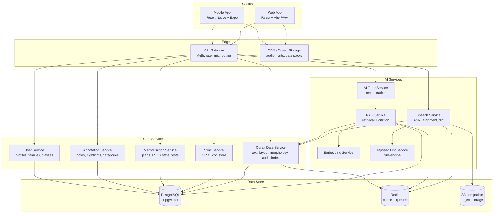
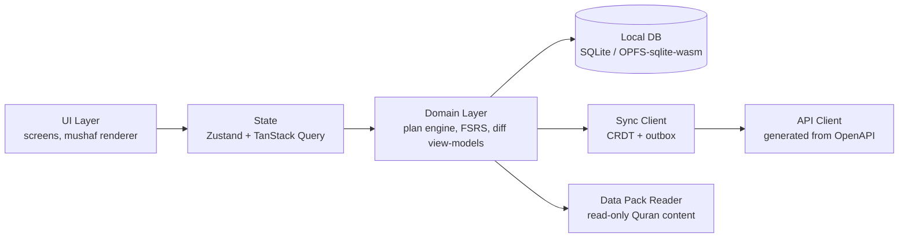
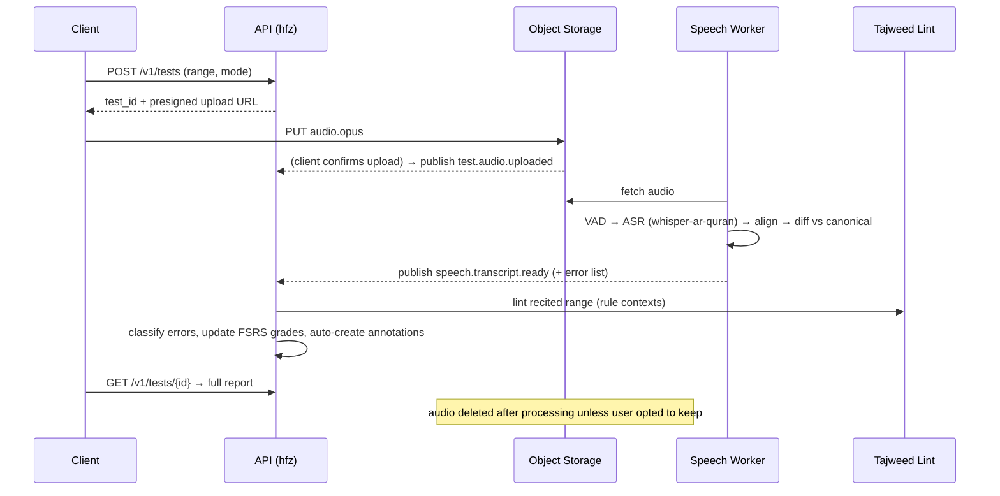

# Architecture

> **Scope:** system architecture (handbook §5) and service boundaries + event
> architecture (handbook §9). This document is **authoritative** for the shapes
> below; when it and the handbook disagree, the handbook wins and this file is
> corrected in the same PR (Rule R5). Owner: Documentation Agent; architectural
> decisions themselves are owned by the Architecture Agent via
> [DECISIONS.md](DECISIONS.md).
>
> **Related:** [DATA.md](DATA.md) (Quran data + packs) · [API.md](API.md) ·
> [SYNC.md](SYNC.md) · [SECURITY.md](SECURITY.md) · [DATABASE.md](DATABASE.md)

---

## 1. High-level architecture



"Service" in the diagram is a **logical** boundary. Physically (D-001) the core
and AI services except Speech are packages inside one FastAPI application
(`services/api/app/<ctx>/`); the Speech worker is a separate process from day 1
because its runtime profile (CPU/GPU-heavy, long jobs) genuinely differs.

## 2. Architectural style & rationale

| Decision | Choice | Alternatives | Rationale |
|---|---|---|---|
| Service granularity | **Modular monolith → extractable services** (single FastAPI app composed of bounded-context packages; Speech runs as a separate worker from day 1) | Full microservices; single flat monolith | AI agents build against clean package boundaries; ops stays simple for self-hosters; the only genuinely different runtime profile (GPU/CPU-heavy speech) is isolated early. |
| Client architecture | **Local-first**: clients own a local database; server is a sync + compute peer | Thin clients | FR-PL-2/3; offline is a pillar; hifz sessions happen without connectivity. |
| Data flow | **REST for request/response, event bus (Redis Streams) for async pipelines** | gRPC, Kafka | REST is friction-free for agents and self-hosters; Redis Streams is already in the stack, sufficient at this scale, upgradeable to NATS/Kafka behind the `events` package interface. |
| Quran content | **Bundled data packs built from Tanzil/QUL + optional live Quran Foundation API** | API-only | API-only breaks offline (FR-PL-2). Data packs are versioned, checksummed artifacts (see [DATA.md](DATA.md)); the API remains a source for pack building and online-only extras. |

Recorded as ADRs: [D-001](adr/D-001-modular-monolith-plus-speech-worker.md),
[D-002](adr/D-002-local-first-clients.md),
[D-004](adr/D-004-signed-data-packs.md),
[D-005](adr/D-005-postgres-pgvector-redis.md), and D-012 (Redis Streams events,
ADR file pending).

## 3. Client architecture (shared pattern, both platforms)



Rules (enforced by dependency-cruiser, Rule R4):

- The **mushaf renderer**, **FSRS engine**, **diff view-model**, and **sync
  client** are shared TypeScript packages (`packages/*`) consumed by both apps —
  never duplicated.
- Local DB schema mirrors the server's logical model for user-owned entities
  (see [DATABASE.md](DATABASE.md)) and is the source of truth on-device.
- All server calls go through the generated API client
  (`packages/api-client/src/generated`, produced by `tools/codegen` from
  `schemas/openapi/`); **no hand-written fetch calls in feature code**.

## 4. Bounded contexts & ownership

| Context | Package | Owns tables | Publishes events | Consumes |
|---|---|---|---|---|
| Identity | `services/api/app/usr` | `usr.*`, `fam.*` | `profile.created` | — |
| Annotation | `.../ann` | `ann.*` | `annotation.created/updated` | `test.error.confirmed` |
| Memorisation | `.../hfz` | `hfz.*` | `test.completed`, `item.reviewed` | `speech.transcript.ready` |
| Quran Data | `.../qds` | `qds.*` | — | — |
| Knowledge/RAG | `.../kb` | `kb.*` | — | — |
| Sync | `.../sync` | `sync.*` | `sync.doc.updated` | — |
| Speech (worker) | `services/speech` | — (object storage only) | `speech.transcript.ready` | `test.audio.uploaded` |
| Tutor | `services/api/app/tutor` | thread tables | — | — |

**Hard rules.** Contexts never import each other's internals; interaction is via
the public Python interface `services/api/app/<ctx>/api.py` or via events. The
Speech worker communicates **only** through events and object storage. Violations
fail CI (import-linter for Python, dependency-cruiser for TypeScript) and are
never suppressed to make a PR pass (Rule R4).

Cross-context data access that "just needs one field" is the classic breach:
the fix is a public read method on the owning context's `api.py`, or an event —
never a direct table or module import. Changing such an interface follows the
**Interface Change Protocol** (`agents/README.md`): RFC issue → Architecture
Agent ADR → schema-first landing with a version bump.

## 5. Event bus

Redis Streams, one stream per event type, consumer groups per service. Envelope
(normative schema: [`schemas/events/envelope.json`](../schemas/events/envelope.json)):

```json
{ "event_id": "uuid", "type": "speech.transcript.ready", "occurred_at": "…",
  "profile_id": "…", "payload": { "test_id": "…", "transcript_ref": "s3://…" }, "schema_version": 1 }
```

- All event payload schemas live in `schemas/events/`; **producers validate
  before publishing** (Rule R1: schema first, then code).
- At-least-once delivery; **consumers are idempotent, keyed on `event_id`**
  (Rule R6) and tolerate redelivery and out-of-order arrival.
- Dead-letter stream per consumer group, with alerting on growth.
- Event bodies carry **references, not content**: object-storage refs for
  transcripts and audio, canonical keys for Quran content. No note bodies,
  transcripts, or user-linked audio paths in events or logs (Rule R7).

Events defined so far (task 0.2):

| Event | Schema | Producer → consumer |
|---|---|---|
| `test.audio.uploaded` | [`schemas/events/test.audio.uploaded.json`](../schemas/events/test.audio.uploaded.json) | api (hfz) → speech worker |
| `speech.transcript.ready` | [`schemas/events/speech.transcript.ready.json`](../schemas/events/speech.transcript.ready.json) | speech worker → api (hfz) |

Adding or changing an event is an interface change: update `schemas/events/`,
log it in `schemas/CHANGELOG.md`, and update this section in the same PR — the
docs-freshness check enforces the last part.

## 6. Core async flow: recitation test



Two invariants worth restating because they are cross-cutting:

1. The **error taxonomy** produced by the diff step (`stop`, `hesitation`,
   `substitution`, `omission`, `insertion`, `similar_jump`, `context_note`) is
   the same enum in the worker, the API, the analytics, and the UI — see
   [SPEECH.md](SPEECH.md) and the terminology check in
   [`docs/ci/`](ci/README.md).
2. Recitation audio is **deleted after processing** unless the user explicitly
   saved or submitted it (NFR-4, FR-TJ-1).

## 7. Current implementation status (Phase 0)

What exists in the repo today, so this document is not read as a description of
running software:

| Element | State |
|---|---|
| Monorepo layout (handbook §21) | Scaffolded (task 0.1) |
| `services/api` (FastAPI) | Health endpoint only; bounded-context packages not yet created |
| `services/speech` | Idle worker skeleton; consumes nothing yet |
| Gateway | Not started (compose stack runs api, speech, postgres, redis, minio) |
| `packages/*` | Directory scaffolds + `api-client` generated types |
| Event bus | Schemas defined (`test.audio.uploaded`, `speech.transcript.ready`); no producer/consumer code yet |
| QDS | OpenAPI read subset specified (`schemas/openapi/qds.yaml`); import pipeline is task 0.3 |
| Boundary lint | dependency-cruiser + import-linter wired as CI stubs |

Update this table whenever a row's state changes.
